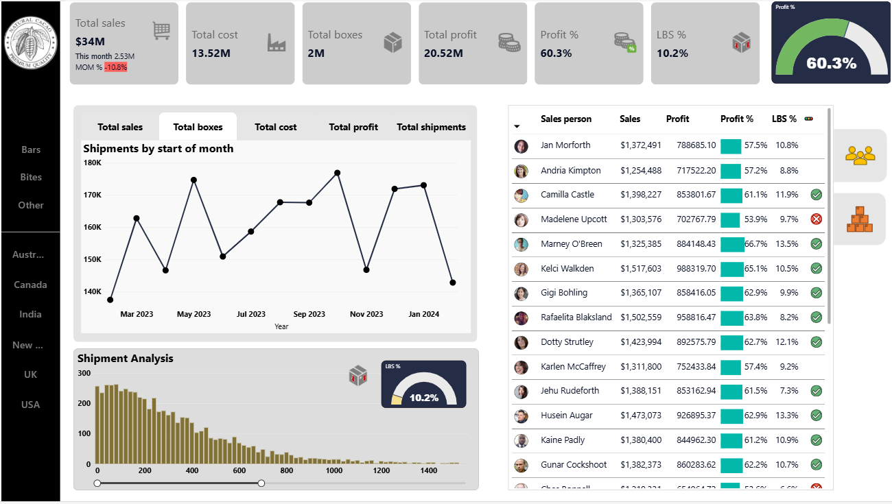

# Power-BI-Sales-Analytics-Dashboard
This repository contains a interactive Sales Analytics Dashboard built using Power BI. 
The dashboard provides insights into total sales, profit %, shipments, cost, box shipment and key business metrics helping businesses make data driven decisions.

🚀 Overview  
This Power BI dashboard provides sales analytics insights helping businesses track total sales, profit margins, shipment trends, and key performance indicators (KPIs). The project demonstrates data modeling, DAX calculations and interactive visualizations in Power BI.  

 

📌 Features  
✅ Key Metrics:Total Sales, Profit %, MoM Changes, LBS %  
✅ Time Intelligence: Month-over-Month (MoM) calculations using DAX 
✅ Data Modeling:Star schema with optimized relationships  
✅ Interactive Visuals:Trend charts, histograms, KPI(Key Performance Indicator) cards, slicers  
✅ Advanced Power BI Features:Field parameters, bookmarks, tooltips, slicer panels  
✅ Gauge Charts & Conditional Formatting:Better data presentation  

📂 Dataset  
The data used in this project is sample sales data for a fictional company. It includes product sales, profit details, and shipment records. 

⚡ Technologies Used  
- Power BI – For dashboard creation and data visualization  
- DAX (Data Analysis Expressions) – To calculate KPIs and business metrics  
- Star Schema Data Modeling – For optimized performance  

📢 Let's Connect!  
I’d love to hear your thoughts on this project! Connect with me on [LinkedIn](your-linkedin-profile) 
